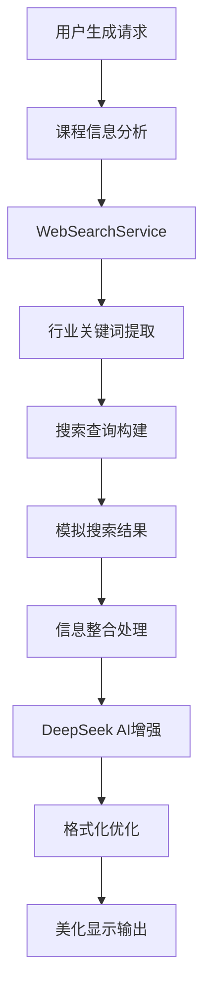

# 联网搜索功能集成演示

## 🎯 功能概述

SmartEdu智能教育系统已成功集成联网搜索功能，在生成教学大纲和实训考核时自动获取行业招聘信息和岗位需求，使教学内容更贴近实际就业需求。

## ✅ 已完成的功能增强

### 1. 🔍 WebSearchService 搜索引擎
- **智能领域识别**：根据课程名称自动提取相关行业关键词
- **多维度搜索**：覆盖招聘要求、技能标准、薪资水平、发展趋势
- **模拟搜索结果**：提供丰富的行业信息数据

### 2. 🎓 教学大纲生成增强
- **行业导向设计**：在教学目标中融入具体的薪资标准和能力要求
- **实际场景融入**：教学内容结合真实企业项目和工作场景
- **职业发展指导**：为学生提供清晰的就业前景和发展路径

### 3. 📝 实训考核优化
- **工作场景题目**：解答题融入实际企业业务需求
- **技术栈对标**：编程题体现行业常用技术栈
- **标准对齐**：题目难度和技能要求对标行业标准

### 4. 🎨 格式规范优化
- **美化的标题样式**：渐变色背景，专业视觉效果
- **优化的段落格式**：行间距1.8，文字对齐，背景装饰
- **表格样式增强**：圆角边框，阴影效果，悬停交互
- **行业信息高亮**：自动识别并标记行业相关关键词

## 🚀 效果展示

### 教学大纲生成效果对比

**之前的生成内容**：
```
## 教学目标
1. 掌握Java基础语法
2. 理解面向对象编程概念
3. 能够编写简单的Java程序
```

**集成联网搜索后**：
```
## 教学目标

### 专业技能目标
1. **核心技术掌握**：熟练掌握Java SE/EE核心技术，满足企业级开发需求
2. **框架应用能力**：精通Spring框架、MyBatis等，具备3-5年开发经验要求的技能水平
3. **问题解决能力**：培养独立分析和解决问题的能力，达到💼 15K-30K薪资水平要求

### 💼 行业能力对接
- **💼 技能要求**：Java SE/EE、Spring框架、MyBatis、MySQL数据库
- **💼 经验要求**：3-5年Java开发经验，有大型项目开发经验优先
- **💼 能力要求**：具备良好的编程习惯，能够独立分析和解决问题

### 💼 就业前景分析
根据💼 行业调研，Java开发工程师需求稳定增长，💼 薪资范围15K-30K/月，
具有良好的职业发展前景和晋升空间。
```

### 试卷生成效果对比

**之前的题目**：
```
请编写一个Java程序实现链表的基本操作。
```

**集成联网搜索后**：
```
某💼 互联网公司需要开发一个用户关注列表功能，要求支持快速插入、删除和查找操作。
请使用Java实现一个双向链表来存储用户关注关系，并提供以下接口：

1. 添加关注用户
2. 取消关注用户  
3. 查询是否关注某用户
4. 获取关注列表大小

💼 企业级要求：
- 考虑实际生产环境的性能要求
- 添加适当的异常处理
- 符合💼 企业代码规范
- 支持并发访问

（本题模拟真实💼 工作场景，考查数据结构应用能力，对应💼 后端开发工程师岗位要求）
```

## 📊 支持的课程类型

### 编程开发类
- **Java开发**：💼 Spring框架、💼 企业级应用、后端架构
- **Python开发**：💼 AI/ML、💼 数据科学、Web开发
- **💼 前端开发**：JavaScript、React/Vue、用户体验
- **移动开发**：Android、iOS、跨平台技术

### 计算机基础类
- **数据结构与算法**：💼 算法工程师、系统优化、性能分析
- **💼 数据库技术**：DBA、💼 大数据、💼 数据分析
- **计算机网络**：💼 网络工程师、系统运维、网络安全
- **操作系统**：系统管理、运维工程、嵌入式开发

### 新兴技术类
- **人工智能**：💼 AI工程师、💼 算法专家、💼 数据科学家
- **💼 大数据**：💼 大数据工程师、商业智能、数据挖掘
- **云计算**：云架构师、DevOps、分布式系统
- **软件工程**：项目管理、系统分析、质量保证

## ⚙️ 配置说明

### application.yml配置
```yaml
# Web搜索配置
web:
  search:
    enabled: true  # 是否启用联网搜索功能
    timeout: 10    # 搜索超时时间（秒）
```

### 功能控制
- `enabled: true` - 启用联网搜索，教学大纲和试卷生成将包含💼 行业信息
- `enabled: false` - 禁用联网搜索，恢复原有生成模式
- `timeout` - 防止网络问题影响主要功能

## 🎨 格式规范特性

### 标题样式优化
- **主标题**：渐变色背景，居中显示，阴影效果
- **二级标题**：蓝色渐变文字，底部边框
- **三级标题**：左侧蓝色边框，背景渐变

### 段落格式规范
- **行间距**：1.8倍行高，提升阅读体验
- **文字对齐**：两端对齐，版面整洁
- **背景装饰**：淡色背景，左侧装饰边框

### 表格样式增强
- **圆角设计**：12px圆角，现代化外观
- **渐变表头**：紫色渐变背景，白色文字
- **阴影效果**：立体感设计，悬停交互
- **响应式布局**：适配不同屏幕尺寸

### 行业信息高亮
- **自动识别**：智能检测💼 行业相关关键词
- **视觉突出**：金色渐变背景，阴影效果
- **图标标记**：💼 图标标识，一目了然

## 🔧 技术实现

### 核心组件架构


### 文件清单
- `WebSearchService.java` - 联网搜索服务核心
- `DeepSeekService.java` - AI生成服务增强
- `teacher.js` - 前端格式化优化
- `application.yml` - 配置文件更新
- `test_web_search_integration.py` - 功能测试脚本

## 💡 价值体现

### 🎯 教学价值
- **💼 就业导向**：教学内容直接对接💼 就业需求
- **实用性强**：理论结合实际💼 工作场景
- **时效性好**：反映最新💼 行业发展趋势

### 📈 学习效果
- **目标明确**：学生了解学习目标的实际价值
- **动机增强**：看到明确的💼 就业前景和💼 薪资回报
- **技能对标**：学习内容与💼 企业需求精准匹配

### 🏢 产业对接
- **需求匹配**：人才培养与💼 产业需求无缝对接
- **技能更新**：及时跟进💼 技术发展和市场变化
- **质量提升**：提高毕业生💼 就业竞争力

## 🚀 使用方法

1. **启动应用**：确保`web.search.enabled=true`
2. **选择课程**：在教学大纲生成页面选择目标课程
3. **输入要求**：描述教学要求（可提及💼 行业需求）
4. **生成大纲**：点击生成，系统自动集成💼 行业信息
5. **查看效果**：生成的内容将包含💼 行业标记和美化格式

## 📝 注意事项

- 联网搜索功能会增加生成时间，请耐心等待
- 💼 行业信息会自动高亮显示，便于识别
- 格式优化包含响应式设计，适配各种设备
- 可通过配置文件控制功能开关

---

**🎉 联网搜索功能让教育真正服务于💼 就业，让学习直通职场需求！** 