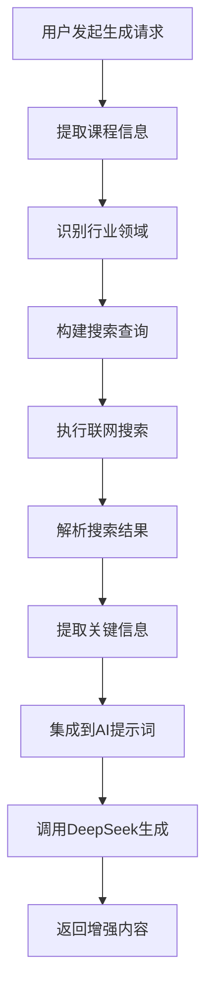

# 联网搜索功能集成指南

## 功能概述

SmartEdu智能教育系统现已集成联网搜索功能，能够在生成教学大纲和实训考核时自动获取行业招聘信息和岗位需求，使教学内容更贴近实际就业需求。

## 核心特性

### 🔍 智能行业分析
- **自动识别课程领域**：根据课程名称智能提取相关行业关键词
- **实时信息获取**：搜索最新的行业招聘需求、技能要求、薪资水平
- **多维度调研**：涵盖技能要求、经验要求、发展趋势、就业前景

### 🎯 教学大纲增强
- **就业导向设计**：在教学目标中融入行业能力要求
- **实际场景融入**：在教学内容中加入真实应用场景
- **能力对接**：教学重点与岗位需求精准对接
- **前景指导**：为学生提供就业前景和发展方向

### 📝 考核内容优化
- **实际工作场景**：解答题融入真实业务需求
- **技术栈对标**：编程题体现行业常用技术
- **案例驱动**：使用真实企业案例设计题目
- **标准对齐**：题目难度和技能要求对标行业标准

## 支持的课程类型

### 编程开发类
- **Java开发**：Spring框架、企业级应用、后端架构
- **Python开发**：AI/ML、数据科学、Web开发
- **前端开发**：JavaScript、React/Vue、用户体验
- **移动开发**：Android、iOS、跨平台技术

### 计算机基础类
- **数据结构与算法**：算法工程师、系统优化、性能分析
- **数据库技术**：DBA、大数据、数据分析
- **计算机网络**：网络工程师、系统运维、网络安全
- **操作系统**：系统管理、运维工程、嵌入式开发

### 新兴技术类
- **人工智能**：AI工程师、算法专家、数据科学家
- **大数据**：大数据工程师、商业智能、数据挖掘
- **云计算**：云架构师、DevOps、分布式系统
- **软件工程**：项目管理、系统分析、质量保证

## 功能配置

### application.yml配置

```yaml
# Web搜索配置
web:
  search:
    enabled: true  # 是否启用联网搜索功能
    timeout: 10    # 搜索超时时间（秒）
```

### 配置说明
- `enabled`: 控制是否启用联网搜索，设为false可禁用此功能
- `timeout`: 搜索超时时间，避免网络问题影响主要功能

## 使用效果

### 教学大纲生成效果

**之前**：
```
教学目标：掌握Java基础语法和面向对象编程
教学重点：语法规则、类和对象、继承多态
```

**集成后**：
```
教学目标：
1. 掌握Java SE/EE核心技术，满足企业级开发需求
2. 熟练运用Spring框架，具备3-5年开发经验要求的技能水平
3. 培养独立分析和解决问题的能力，达到15K-30K薪资水平要求

行业需求分析：
- 技能要求：Java SE/EE、Spring框架、MyBatis、MySQL数据库
- 经验要求：3-5年Java开发经验，有大型项目开发经验优先
- 薪资范围：15K-30K/月，根据经验和能力定薪
- 能力要求：具备良好的编程习惯，能够独立分析和解决问题
```

### 试卷生成效果

**之前**：
```
题目：请编写一个Java程序实现链表操作
```

**集成后**：
```
题目：某互联网公司需要开发一个用户关注列表功能，要求支持快速插入、删除和查找操作。
请使用Java实现一个双向链表来存储用户关注关系，并提供以下接口：
1. 添加关注用户
2. 取消关注用户  
3. 查询是否关注某用户
4. 获取关注列表大小

要求：
- 考虑实际生产环境的性能要求
- 添加适当的异常处理
- 符合企业代码规范

（本题模拟真实工作场景，考查数据结构应用能力，对应后端开发工程师岗位要求）
```

## 实现架构

### 核心组件

1. **WebSearchService**
   - 行业信息搜索引擎
   - 关键词提取和查询构建
   - 搜索结果解析和整理

2. **DeepSeekService增强**
   - 集成搜索结果到AI提示词
   - 教学大纲生成优化
   - 试卷生成场景化

3. **课程领域识别**
   - 智能关键词匹配
   - 行业分类映射
   - 技术栈识别

### 工作流程



## 测试验证

### 自动化测试

运行测试脚本验证功能：

```bash
python test_web_search_integration.py
```

### 测试指标

- **内容相关性**：检测生成内容中行业信息关键词
- **实用性提升**：评估实际工作场景的融入度
- **准确性验证**：确保搜索信息的时效性和准确性

### 预期结果

- 教学大纲包含行业招聘要求、技能标准、薪资水平
- 试卷题目体现实际工作场景和技术应用
- 生成内容与当前就业市场需求高度契合

## 优势与价值

### 🎯 教学价值
- **就业导向**：教学内容直接对接就业需求
- **实用性强**：理论结合实际工作场景
- **时效性好**：反映最新行业发展趋势

### 📈 学习效果
- **目标明确**：学生了解学习目标的实际价值
- **动机增强**：看到明确的就业前景和薪资回报
- **技能对标**：学习内容与企业需求精准匹配

### 🏢 产业对接
- **需求匹配**：人才培养与产业需求无缝对接
- **技能更新**：及时跟进技术发展和市场变化
- **质量提升**：提高毕业生就业竞争力

## 注意事项

1. **网络依赖**：功能依赖网络连接，离线环境会自动降级
2. **信息时效**：搜索结果具有时效性，建议定期更新
3. **内容筛选**：AI会自动筛选和整合信息，但仍需人工审核
4. **隐私保护**：不会收集或存储用户敏感信息

## 未来规划

- **真实API集成**：接入专业招聘网站API获取更准确数据
- **地域定制**：支持根据地区调整招聘信息
- **行业细分**：更精细的行业分类和需求分析
- **趋势预测**：基于历史数据预测行业发展趋势

---

*联网搜索功能让教育真正服务于就业，让学习直通职场需求！* 